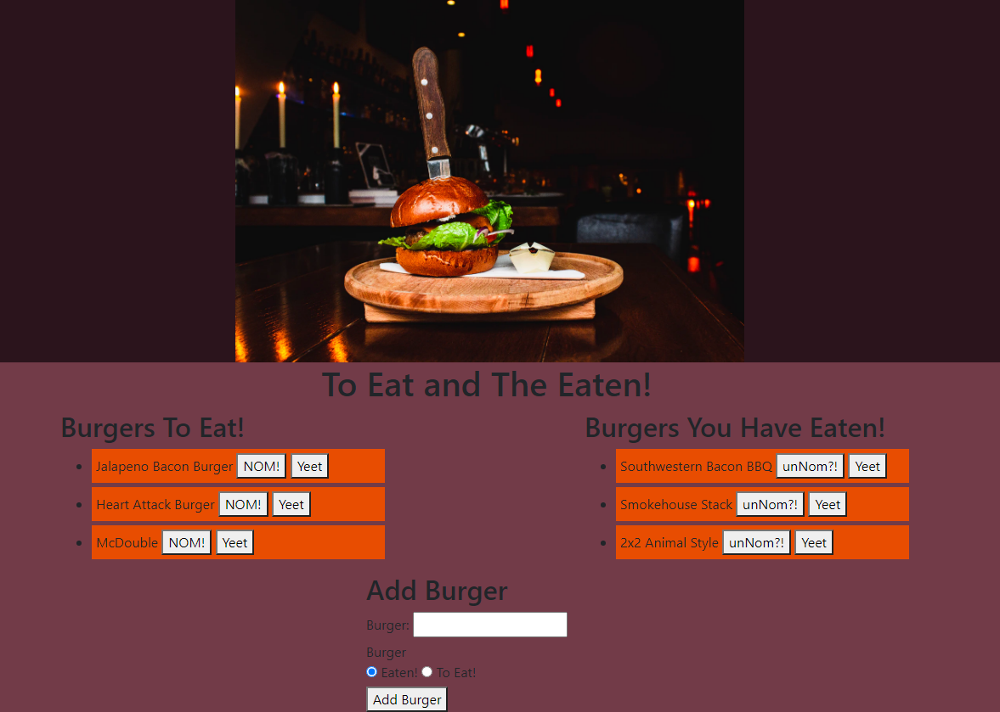

# Burger Tracker

## Table Of Contents
<!-- click each bullet to move to the associated section -->
* [Description](#description)
* [Install](#install)
* [Usage](#usage)
* [Contribute](#contribute)
* [Check It Out!](#check)
* [License](#license)
* [Questions](#questions)
## Description

Track the burgers you have eaten as well as those you haven't! Stores the names of burgers you have added and allows you to change their status or remove them entirely.

## Install

npm install will install the required dependencies if you wish to run this app locally. It is currently hosted on Heroku.

## Usage

This project is used to make a list of burgers you want to eat and those you have! Keep track of your foodie journey along the way!

## Contribute?

Git clone and npm install the dependencies to alter the code. Any changes should be commented thoroughly and will be reviewed by myself before any changes are pushed to the main branch.

## Check It Out!

## License

This application is covered under MIT License.
Copyright 2021 Zachary Favela
       
        Permission is hereby granted, free of charge, to any person obtaining a copy of this software and associated documentation files (the "Software"), to deal in the Software without restriction, including without limitation the rights to use, copy, modify, merge, publish, distribute, sublicense, and/or sell copies of the Software, and to permit persons to whom the Software is furnished to do so, subject to the following conditions:
        
        The above copyright notice and this permission notice shall be included in all copies or substantial portions of the Software.
        
        THE SOFTWARE IS PROVIDED "AS IS", WITHOUT WARRANTY OF ANY KIND, EXPRESS OR IMPLIED, INCLUDING BUT NOT LIMITED TO THE WARRANTIES OF MERCHANTABILITY, FITNESS FOR A PARTICULAR PURPOSE AND NONINFRINGEMENT. IN NO EVENT SHALL THE AUTHORS OR COPYRIGHT HOLDERS BE LIABLE FOR ANY CLAIM, DAMAGES OR OTHER LIABILITY, WHETHER IN AN ACTION OF CONTRACT, TORT OR OTHERWISE, ARISING FROM, OUT OF OR IN CONNECTION WITH THE SOFTWARE OR THE USE OR OTHER DEALINGS IN THE SOFTWARE.
## Questions

For more content, check out my [GitHub](https://github.com/ZacharyBinx)!

Any questions regarding this project can be sent to ZacharyBinxGit@gmail.com and I will respond as soon as reasonably possible.
